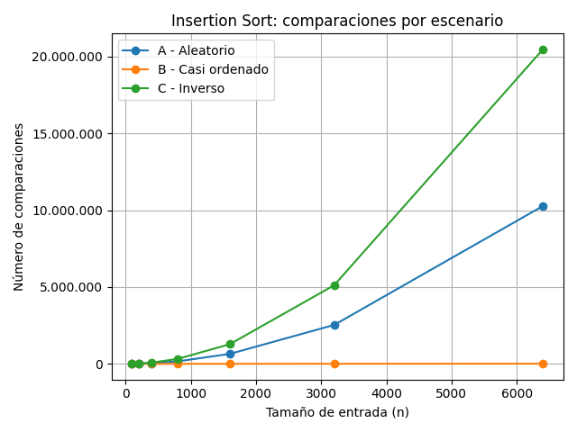
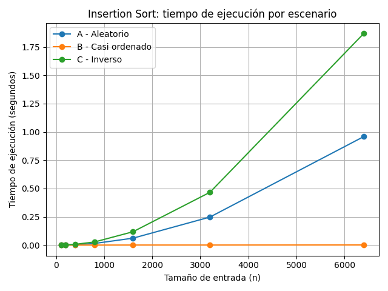
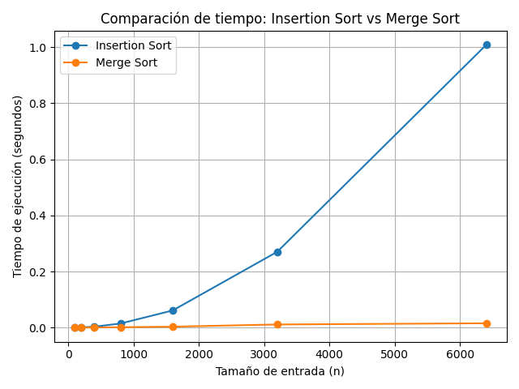

# Laboratorio 1 — Fundamentos, Complejidad y Recurrencias

**Estudiante:** Geremy Santa Duque

---

## Instrucciones para reproducir el experimento

Para ejecutar los experimentos del laboratorio, primero se debe activar el entorno virtual y ubicarse en la carpeta del laboratorio.

```bash
python parte3_casos.py
```

Este comando ejecuta el experimento de la Parte 3 para los tres escenarios y los siete tamaños de entrada definidos, y genera las gráficas correspondientes en la carpeta graficas/.

```bash
python parte4_complejidad.py
```

Este comando ejecuta la comparación de tiempo entre Insertion Sort y Merge Sort sobre el escenario A, utilizando los mismos siete tamaños de entrada de la Parte 3, y genera la gráfica parte4_tiempo.png en la carpeta graficas/.

---

> **Nota sobre la reproducción:** Después de realizar los experimentos y documentar los resultados presentados en este informe, se creó y activó el entorno virtual de la raíz del repositorio (`venv`) y se instaló el contenido de `requirements.txt`. Posteriormente se ejecutaron nuevamente los experimentos para comprobar que el laboratorio pudiera reproducirse correctamente desde este entorno. Como los tiempos de ejecución dependen del entorno y de la máquina donde se ejecuten, esta segunda ejecución presentó variaciones en los tiempos, mientras que las cantidades de comparaciones se mantuvieron iguales. Los resultados analizados en el informe corresponden a la ejecución utilizada originalmente para realizar el análisis.

---

## Parte 1 — Analizar el algoritmo antes de comprar hardware

En este caso es importante empezar teniendo en cuenta las condiciones actuales del sistema. Que el algoritmo funcione y entregue el resultado correcto no significa que siga siendo adecuado para el contexto del sistema que mencioné. El Insertion Sort puede cumplir con la tarea asignada de ordenar los registros, pero solo se está viendo un lado del problema, ya que la condición de cumplir esta tarea dentro del rango de tiempo necesario no se está cumpliendo. Es decir, no podemos seguir utilizando algo que cumple correctamente una parte de la necesidad, pero que no logra cumplir con el tiempo requerido para completar todo el proceso.

Aunque el resultado correcto nos llegue después del tiempo establecido, esto significa incumplir con la necesidad del sistema: recibir el resultado en una hora determinada con el fin de realizar las llamadas al inicio del día. La tarea del centro de contacto es realizar las llamadas según el orden de criticidad de los registros, pero si esta tarea no se puede cumplir según la necesidad por la dependencia que existe del resultado del algoritmo, significa que no se está afectando una sola parte del proceso, sino todo el proceso.

Duplicar la velocidad, aunque reduzca el tiempo de ejecución, no soluciona el problema de fondo. En este caso, el inconveniente no radica solamente en qué tan rápido trabaja el servidor, sino en cómo aumentará el trabajo que debe realizar el algoritmo cuando la cantidad de registros aumente. Claramente, debemos contemplar que en el futuro la información seguirá creciendo. Antes de invertir en hardware, lo importante sería analizar si el algoritmo que se está utilizando sigue siendo apropiado para el problema actual y para el crecimiento esperado de los registros.

Un ejemplo propio lo he encontrado en mi trabajo mientras participo en el desarrollo de **CCT (Customer Control Tower)**, una plataforma que busca centralizar información para los comerciales y otras áreas, y que también sirve como apoyo para la generación de prefacturas. En este proyecto desarrollé en Python una ETL que lee reportes de Excel, carga la información en una tabla de la base de datos y posteriormente realiza un *match* entre los registros de los reportes y la tabla de clientes. En nuestro caso se procesaban aproximadamente dos reportes de 15.000 filas cada uno, es decir, cerca de 30.000 registros. El proceso puede producir correctamente las correspondencias, pero si el volumen aumentara considerablemente y el algoritmo utilizado para realizar el *match* necesitara revisar demasiados registros para encontrar cada coincidencia, el resultado podría seguir siendo correcto, pero tardar demasiado para que la información estuviera disponible a tiempo para la prefacturación mensual. En ese escenario, el algoritmo sería correcto, pero dejaría de ser viable respecto al tiempo de procesamiento.

Por esto, analizar el algoritmo permite determinar si el problema se puede solucionar realmente con más hardware o si es necesario mejorar primero la forma en que se procesa la información.

---

## Parte 2 — Responsabilidad ambiental y ética

En la primera parte realizamos un análisis sobre una dimensión más técnica del sistema, donde nos importaba únicamente temas como la eficiencia y la corrección. Sin embargo, tomar la decisión de qué algoritmo usar no solo implica pensar en lo anterior, sino también pensar en los recursos y consecuencias que tiene en las personas el hecho de ejecutar el proceso. Hablando desde un punto de vista ambiental, la simple duración que conlleve ejecutar el proceso y el hecho de que este tiempo aumente implica que se utilizan muchos más recursos de procesamiento, lo que en palabras más claras es el aumento significativo de energía. Hay un caso a tener en cuenta y es que Tamiza no es un proceso que solo se ejecute una vez al mes, sino que por el contrario se ejecuta todos los días en la madrugada, por lo que el consumo de energía que parece poco no lo es debido a la constancia de ejecución. Adicional a esto, el consumo que mencionamos no solo corresponde al procesamiento, sino también a los recursos que se usan y son necesarios para mantener funcional la infraestructura que se hace cargo del proceso. Aunque jueguen demasiados aspectos en la elección de un algoritmo, pensar en el impacto ambiental implica pensar en escoger un algoritmo que realice el trabajo en menos tiempo, pues esto significa un uso más responsable de los recursos tecnológicos implicados en el proceso.

Como parte ética y según el contexto brindado aquí, la importancia es mucho más agravante, pues el proceso trabaja con información relacionada a la salud de los pacientes. Para hablar mejor de esta parte lo haremos bajo un ejemplo: si el algoritmo tarda demasiado y realiza la entrega parcial de la lista, un paciente que puede estar con un índice de riesgo alto puede estar quedando afuera de la lista que recibe el centro de contacto. Al principio podríamos decir que no es importante ya que la ejecución es diaria, pero no tenemos un control ni la posibilidad de saber que en un minuto la vida cambia, en especial cuando las condiciones de salud no son óptimas; con lo anterior dejamos un antecedente y es que quien asume el costo de esto es el paciente directamente. Adicionalmente, también existe un costo ético para la persona que se encuentra en el centro de contacto, ya que en este caso debe trabajar con un insumo que no representa el orden de prioridad. Aunque el operador no es responsable del problema, el costo operativo recae también en la secretaría, la cual debe garantizar y asegurarse de que el proceso funcione bajo las condiciones establecidas.

Existe una tensión importante en este caso: el ordenamiento más que ser una regla de negocio del sistema, es una decisión donde se juega con la vida de las personas, es decir, el orden determina a quién se llama primero. Por lo anterior, que el algoritmo realice bien su objetivo adquiere una responsabilidad adicional a la de terminar dentro de las 4 horas, pues debe entregar una lista en donde el orden corresponda al índice de riesgo de un paciente, el cual se lo define el proceso. Es importante cumplir y tener un equilibrio en muchos de los aspectos con los que el proceso interactúa, pues en este caso una implementación rápida que ordene incorrectamente también puede generar un costo mortal en los pacientes.

## Parte 3 — Peor caso, mejor caso y caso promedio

### 3.1 — Explicación

Para mí, el peor caso se presenta cuando, teniendo una cantidad de datos fija, se da una entrada que hace que el algoritmo tenga que realizar la mayor cantidad de trabajo posible. El mejor caso sería lo contrario a lo que mencione antes: una entrada del mismo tamaño en la que el algoritmo tenga que hacer la menor cantidad de trabajo. Por ultimo el caso promedio sería el comportamiento que tenemos al considerar diferentes entradas del mismo tamaño y observar cuál es el comportamiento que normalmente se puede esperar.

Para decidir si Tamiza puede utilizar el algoritmo en producción,es importante considerar que se debe tener en cuenta principalmente el peor caso. la razon es que la ventana de cuatro horas es una condición que no se puede superar. Por lo anterior no bastaria comprobar que el algoritmo funciona bien cuando recibe una entrada favorable, porque también debemos saber qué puede pasar cuando los datos lleguen en una situación que le genere mucho más trabajo. Cuando contemplamos el peor caso como prioridad de prueba y si en ese escenario supera las cuatro horas, el problema vuelve a ser el mismo: la lista no estaría disponible completa cuando el centro de contacto la necesita.

Antes de hacer las pruebas, mi primera impresión sobre los tres escenarios es que el escenario C, que llega en orden inverso, podría ser el peor para Insertion Sort. Lo antetior debido a que el algoritmo tendría que ir acomodando los elementos que están en una posición muy diferente de la que necesitan, lo que haria que se presentaran probablemente muchas comparaciones. En cambio, el escenario B, que ya tiene el 98 % de los datos ordenados, debería ser el que menos trabajo necesite, ya que la mayor parte de los registros estan en una posición adecuada.

Para el escenario A, que tiene los datos en un orden aleatorio, esperaría un comportamiento que se encuentre en un punto medio de los anteriores y que pueda representar una situación más cercana a lo que normalmente encontraríamos cuando los datos no tienen un orden específico. Las mediciones serán las que permitan comprobar si realmente ocurre de esta manera.

### 3.2 — Experimento en Python

La implementación utilizada para el experimento se encuentra en [`algoritmos.py`](algoritmos.py) y los generadores de datos de los tres escenarios se encuentran en [`datos.py`](datos.py). El experimento completo se encuentra en [`parte3_casos.py`](parte3_casos.py).

Para realizar las pruebas se utilizaron siete tamaños de entrada:

- 100
- 200
- 400
- 800
- 1600
- 3200
- 6400

Para cada tamaño se ejecutó `insertion_sort` sobre los escenarios A, B y C. El tiempo se midió utilizando `time.perf_counter()` y se contó el número de comparaciones realizadas entre elementos de la lista. La generación de los datos se realizó antes de iniciar el cronómetro, por lo que no hace parte del tiempo registrado.

Los resultados obtenidos fueron los siguientes:

| Tamaño | A comparaciones | A tiempo (s) | B comparaciones | B tiempo (s) | C comparaciones | C tiempo (s) |
| -----: | --------------: | -----------: | --------------: | -----------: | --------------: | -----------: |
|    100 |           2.542 |       0,0004 |             100 |       0,0003 |           4.950 |       0,0008 |
|    200 |           9.970 |       0,0012 |             203 |       0,0005 |          19.900 |       0,0034 |
|    400 |          40.436 |       0,0082 |             417 |       0,0005 |          79.800 |       0,0154 |
|    800 |         160.484 |       0,0331 |             866 |       0,0005 |         319.600 |       0,0616 |
|   1600 |         648.481 |       0,1005 |           1.851 |       0,0008 |       1.279.200 |       0,1822 |
|   3200 |       2.533.103 |       0,3976 |           4.172 |       0,0011 |       5.118.400 |       0,8215 |
|   6400 |      10.276.753 |       1,5970 |          10.277 |       0,0018 |      20.476.800 |       2,6352 |

#### Comparaciones

La siguiente gráfica muestra el número de comparaciones realizadas por Insertion Sort para cada escenario:



#### Tiempo de ejecución

La siguiente gráfica muestra el tiempo de ejecución medido para cada escenario:



### Análisis de los resultados

Los resultados obtenidos coinciden con la predicción realizada en la sección 3.1. El escenario C fue el que presentó la mayor cantidad de comparaciones para todos los tamaños evaluados. Para `n = 6400`, realizó 20.476.800 comparaciones y tuvo un tiempo de ejecución de aproximadamente 2,64 segundos. Por esta razón, dentro de los escenarios evaluados, C presentó el peor comportamiento para Insertion Sort.

El escenario B presentó el menor número de comparaciones y el menor tiempo en las pruebas. Para `n = 6400` realizó 10.277 comparaciones y tardó aproximadamente 0,0018 segundos. Esto se relaciona con que el 98 % de los datos ya se encuentra ordenado y el algoritmo necesita hacer mucho menos trabajo.

El escenario A quedó entre B y C. Para `n = 6400` realizó 10.276.753 comparaciones y tardó aproximadamente 1,60 segundos. Como se manejaron datos aleatorios, este escenario se aproxima al comportamiento que se puede esperar del caso promedio, aunque esta prueba no demuestra matemáticamente el caso promedio para todas las entradas posibles.

Por lo tanto, los resultados experimentales coinciden con la predicción inicial donde C tuvo el comportamiento más costoso, B el menor costo entre los escenarios planteados y A quedó en una posición intermedia.

---

## Parte 4 — Complejidad de merge sort e insertion sort: cálculo y validación

### 4.1 — Cálculo teórico

#### Merge Sort

Para calcular la complejidad de Merge Sort parto de la siguiente recurrencia:

T(n) = 2T(n/2) + Θ(n)

El 2T(n/2) aparece porque la lista se divide en dos partes y cada una de ellas tiene aproximadamente la mitad de los elementos. Después de ordenar las dos partes, se deben volver a unir en una sola lista ordenada. Este proceso de combinación tiene un costo Θ(n), porque se deben recorrer los elementos de las dos partes.

Para resolver la recurrencia voy a utilizar el método maestro. La forma general es:

`T(n) = aT(n/b) + f(n)`

En este caso:

a = 2
b = 2
f(n) = Θ(n)

Primero calculo:

`n^(log_b a)`

Reemplazando los valores:

`n^(log_2 2) = n`

Entonces f(n) y n^(log_b a) tienen el mismo orden:

`Θ(n) = Θ(n)`

Por esto corresponde al caso 2 del método maestro y la complejidad final de Merge Sort es:

`T(n) = Θ(n log n)`

#### Insertion Sort

Para calcular la complejidad de Insertion Sort voy a tener en cuenta la implementación que utilicé en este laboratorio.

En el peor caso, los datos llegan en el orden contrario al que necesitamos obtener. Por ejemplo, si queremos ordenar de mayor a menor y recibimos:

[1, 2, 3, 4, 5]

el algoritmo tiene que ir recorriendo los elementos que ya fueron procesados y desplazarlos hacia la derecha para poder ubicar cada nuevo elemento en la posición que corresponde.

En este caso, el `for` se ejecuta `n - 1` veces. Dentro de cada iteración, el `while` puede recorrer todos los elementos que ya fueron procesados.
Las comparaciones que se realizan van aumentando de esta forma:

`1 + 2 + 3 + ... + (n - 1)`
``

Esta suma es:

`n(n - 1) / 2`

que al desarrollar queda:

`(n² - n) / 2`

Por lo tanto, el término que más crece es `n²` y el peor caso de Insertion Sort es:

`T(n) = Θ(n²)`

| Instrucción                         | En el peor caso                   |
|-------------------------------------|-----------------------------------|
| `datos.copy()`                      | Se copian `n` elementos           |
| `for`                               | `n - 1` veces                     |
| `clave = copia[i]`                  | `n - 1` veces                     |
| `j = i - 1`                         | `n - 1` veces                     |
| `comparaciones += 1`                | `n(n - 1) / 2` veces              |
| `if copia[j] >= clave`              | `n(n - 1) / 2` veces              |
| `copia[j + 1] = copia[j]`           | `n(n - 1) / 2` veces              |
| `j -= 1`                            | `n(n - 1) / 2` veces              |
| `copia[j + 1] = clave`              | `n - 1` veces                     |

Si sumamos los costos de las instrucciones, tenemos operaciones constantes y lineales, pero también varias instrucciones que se repiten `n(n - 1) / 2` veces. Por lo tanto, el término que termina dominando el crecimiento es el cuadrático y se obtiene:

`T(n) = Θ(n²)`

### Complejidad según el caso

| Algoritmo       | Mejor caso  | Caso promedio | Peor caso |
|-----------------|-------------|---------------|-----------|
| Insertion Sort  | Θ(n)        | Θ(n²)         | Θ(n²)     |
| Merge Sort      | Θ(n log n)  | Θ(n log n)    | Θ(n log n)|

En esta tabla se puede ver que Insertion Sort puede tener un comportamiento lineal cuando los datos ya están ordenados de la forma que el algoritmo lo necesita, pero cuando los datos requieren muchos cambios su crecimiento pasa a ser cuadrático. Merge Sort mantiene Θ(n log n) en los tres casos.

### Resultados

| Tamaño | Insertion Sort (s) | Merge Sort (s) |
|--------|--------------------|----------------|
| 100    | 0,00038            | 0,00025        |
| 200    | 0,00139            | 0,00050        |
| 400    | 0,00587            | 0,00115        |
| 800    | 0,02439            | 0,00333        |
| 1600   | 0,10504            | 0,00588        |
| 3200   | 0,39434            | 0,01165        |
| 6400   | 1,68022            | 0,02537        |



### Análisis de los resultados de la parte 4

Despues de observar la gráfica como parte del experimento, podemos evidenciar que para los tamaños pequeños de datos (eje horizontal) la diferencia entre los dos algoritmos es demasiado mínima. Esto se puede notar especialmente en los 4 primero puntos de la gráfica, donde los tiempos de ambos se encuentran bastante cerca. Sin embargo, lo mas evidente que podemos decir es que a medida que aumenta el tamaño de entrada, las curvas empiezan a separarse cada vez más.

Otro punto para analizar es que en el algorimo Insertion Sort el tiempo aumenta rápidamente, en comparación al aumento lineal y poco pronunciado que se tiene con Merge Sort. Para `n = 6400` el tiempo registrado fue de aproximadamente 1,68 segundos. En cambio, Merge Sort para el mismo tamaño que mencionamos tuvo un tiempo aproximado de 0,025 segundos. Con lo anterior damos muestra de que el crecimiento del tamaño de entrada afecta mucho más al tiempo de Insertion Sort que al de Merge Sort en este experimento.

A partir de la gráfica, para el escenario A de Tamiza, Merge Sort presenta un menor tiempo de ejecución a medida que aumenta la cantidad de registros. Por lo que facilmente podemos concluir en este punto es que en este caso la gráfica muestra que Merge Sort se adapta mejor al crecimiento de la entrada.

Esta observación coincide con lo calculado en la sección 4.1. Allí se obtuvo `Θ(n²)` para el caso promedio de Insertion Sort y `Θ(n log n)` para Merge Sort. Los resultados experimentales muestran precisamente una separación cada vez mayor entre ambas curvas cuando `n` aumenta.

En los tamaños pequeños los tiempos pueden verse más cercanos porque la cantidad de datos todavía es baja y la diferencia de crecimiento entre las dos complejidades todavía no se refleja de forma tan evidente en el tiempo medido.

### 4.3 — Concepto técnico a la Secretaría de Salud

Considerando que no podemos controlar cómo llegan los datos desde Tamiza y que mantener tres versiones del código no es una opción eficiente para el equipo, mi recomendación es inclinarnos por Merge Sort. Más allá de la teoría sobre complejidad, esta decisión la tomo basándome directamente en lo que vimos en las pruebas prácticas.

En la Parte 3 quedó muy clara la inestabilidad de Insertion Sort: cuando analizamos el escenario C con n = 6.400, el algoritmo tuvo que hacer más de 20 millones de comparaciones (20.476.800), mientras que en el escenario B la cifra disminuye drásticamente a solo 10.277. Con lo anterior, se demuestra el riesgo que corremos si dependemos de que los datos vengan preordenados, ya que cualquier cambio en la entrada dispara el costo operativo que tendría el sistema.Para consolidar nuestra decisión podemos evidenciar que la diferencia se nota aún más al mirar los tiempos de ejecución de la Parte 4 (escenario A). Con n = 6.400, Insertion Sort se tomó alrededor de 1,68 segundos, mientras que Merge Sort resolvió el mismo volumen en apenas 0,025 segundos. Si revisamos la gráfica  que se encuentra en parte4_tiempo.png, la diferencia entre ambos algoritmos visualmente es enorme y se va ampliando conforme crece n. Por eso, para un entorno variable como el de Tamiza, no podemos conservar un algoritmo tan sensible al estado de los datos.

Ahora, si llevamos esto a la escala real de 1.200.000 registros (que representa multiplicar la muestra por 187,5), las proyecciones que realizamos lo confirman:

•Con Insertion Sort, proyectando su crecimiento cuadrático `Θ(n²)`, en el escenario A nos iríamos a unas 16,4 horas. Pero no sería lo más malo, ya que si tomamos el peor caso visto en la Parte 3 (escenario C), la extrapolación se dispara a unas 25,7 horas. En cualquiera de los dos casos quedamos sin cumplir la ventana límite de 4 horas.

•Con Merge Sort, partiendo de los 0,025 segundos y aplicando su crecimiento `Θ(n log n)`, el tiempo estimado para esa misma cantidad de datos se aproxima a los 7,6 segundos. Cabe aclarar que estos valores son estimaciones por extrapolación a partir de los datos medidos y no pruebas directas con 1.200.000 registros, pero la diferencia de magnitud es bastante amplia.

Sobre la idea de solucionar el problema, comprando un servidor con el doble de potencia, considero que es una solución de momento la cual  no contempla solucionar la raíz del problema. Aunque duplicar la velocidad reduzca los tiempos a la mitad, Insertion Sort en el escenario C pasaría de 25,7 horas a unas 12,9 horas, lo cual sigue estando muy lejos de las 4 horas permitidas que fueron asignadas al sistema. Un componente hardware más rápido no cambia la escala matemática de un algoritmo.

Por último, hay que tener presente el trade-off ( lo que ganamos y perdemos) de memoria: Merge Sort requiere estructuras auxiliares para la división y mezcla, lo que implica un mayor consumo de memoria RAM en comparación con Insertion Sort (que trabaja in-place, es decir, fijo o en su sitio). Es un factor que debe ser tenido en cuenta  ya que debemos dimensionar bien a nivel de infraestructura, pero que de ninguna manera le quite importancia a la necesidad prioritaria de cumplir con los tiempos de procesamiento.
